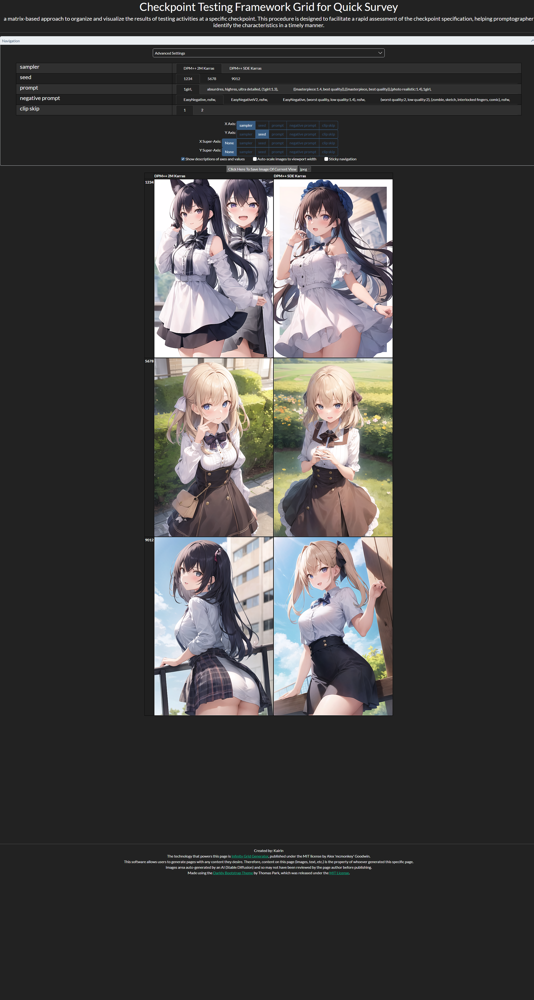

# stable-diffusion-checkpoint-testing-framework

## 画像生成AIモデルの検証を仕組み化する試み v1.0

Stable Diffusion系の生成モデルはカンブリア紀まっただ中。

爆発的な進化の連鎖が止まらず、日々大量のモデル/Model/Checkpointが新規に公開あるいは更新されています。

しかしながら、各モデルの特性を適切に把握することは容易ではありません。

そこで、AI生成モデルの検証方法を仕組み化し、容易に再現可能にすることで、効率的かつ効果的な調査を可能とする試みを提案します。

仕組みの構築にあたって、以下の前提を重要視しました。

- 手間をかけずに検証の準備ができるよう、モデルをセットアップしてから数クリックで開始できるようにする
- 評価シナリオをある程度統一し、客観的に評価できるようにする
- 仕組化することで、試行錯誤を資産として残せるようにし、利用者視点でのモデル研究を効率化する
- 仕組化により検証シナリオ自体にもフィードバックループを働かせ、改善を重ねやすくする

手法の詳細は以下の記事を参照してください。

[画像生成AIモデルの検証を仕組み化する試み v1.0](https://kai-rin.fanbox.cc/posts/5868118)

このページは、Stable Diffusion Infinity Grid Generator により生成された各モデルの検証グリッドをウェブブラウザから容易に参照することを目的としています。

リンク先で表示される検証グリッドの例

## 各モデルの検証Gridへのリンク

as of 2023-05-03 23:03 JST

- [a7b3_v10](./a7b3_v10/index.html) | [civitai](https://civitai.com/models/43804/a7b3)
- [anything-v4.5-pruned-fp16](./anything-v4.5-pruned-fp16/index.html) | [huggingface](https://huggingface.co/andite/anything-v4.0)
- [anythingV5PrtRE](./anythingV5PrtRE/index.html) | [civitai](https://civitai.com/models/9409/or-anything-v5)
- [breakdomain_M2000_preview](./breakdomain_M2000_preview/index.html) | [一般公開前（2023-05-03時点）](https://www.fanbox.cc/@br-d/posts/5858016)
- [breakdomainrealistic_M1871](./breakdomainrealistic_M1871/index.html) | [civitai](https://civitai.com/models/54917/breakdomainrealistic)
- [breakdro_I1464](./breakdro_I1464/index.html) | [civitai](https://civitai.com/models/28828/breakdro)
- [cityedgeToonmix_v312](./cityedgeToonmix_v312/index.html) | [civitai](https://civitai.com/models/45616/cityedgetoonmix)
- [coremixpure_v10](./coremixpure_v10/index.html) | [civitai](https://civitai.com/models/41206/coremixpure)
- [Counterfeit-V3.0_fp16](./Counterfeit-V3.0_fp16/index.html) | [huggingface](https://huggingface.co/gsdf/Counterfeit-V3.0)
- [ghostmix_v11Bakedvae](./ghostmix_v11Bakedvae/index.html) | [civitai](https://civitai.com/models/36520/ghostmix)
- [meinamix_meinaV9](./meinamix_meinaV9/index.html) | [civitai](https://civitai.com/models/7240/meinamix)
